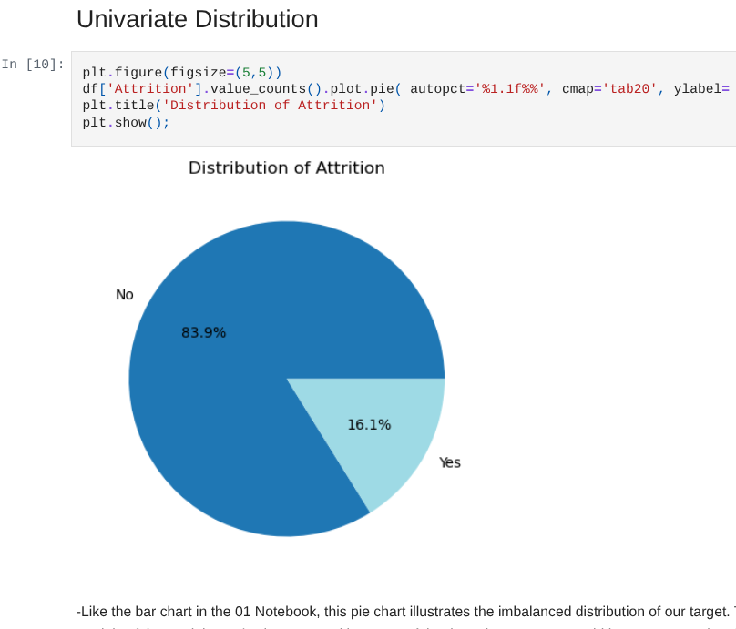
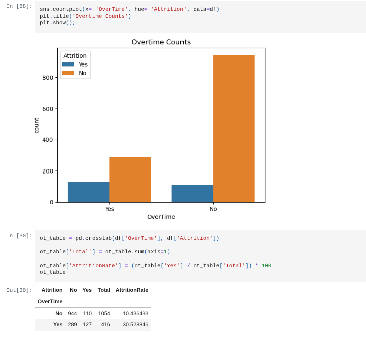
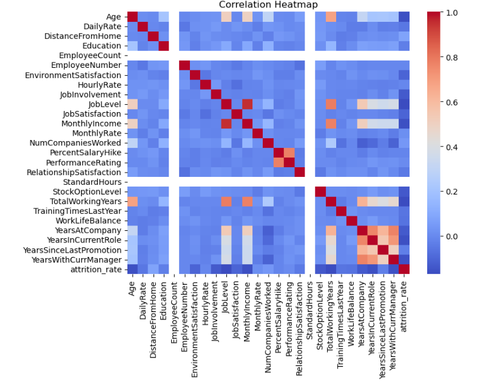
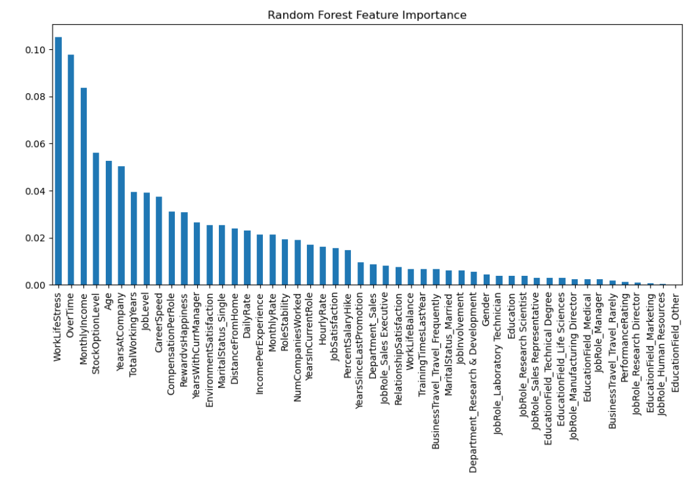
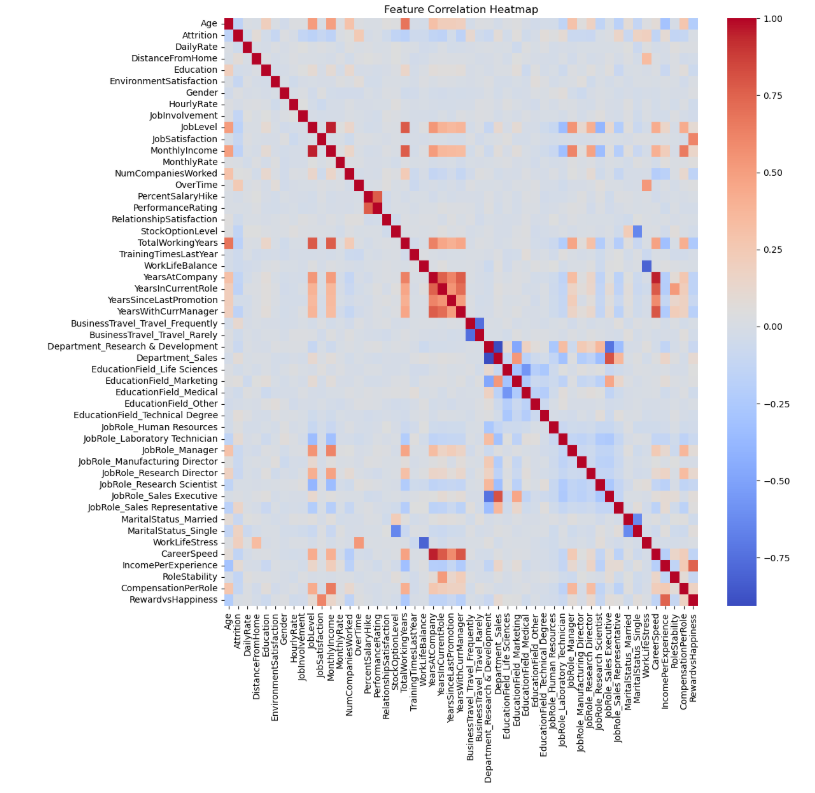

# HR Attrition Analysis & Prediction
**Rachel Hill-Tsarpelas** | Data Analyst Portfolio Project  

## Project Overview
This project investigates employee attrition with the goal of identifying patterns, risk factors, and actionable insights that can support HR decision-making. The analysis follows a structured, multi-day workflow covering data understanding, visualization-driven exploration, and machine learning modeling.

---

## Objectives
1. Suggest hypotheses about the causes of observed employee attrition
2. Assess assumptions on which statistical inference will be based
3. Support the selection of appropriate statistical tools and techniques
4. Provide a basis for further data collection or HR interventions

---

## Part 1 — Data Overview
- Loaded dataset
- Identified numeric/categorical columns
- Checked for missing values
- Summarized key variables and observed class imbalance (~16% attrition)

**Visual — Summary of Attrition Imbalance**  

---

## Part 2 — Exploratory Visualizations
- Explored attrition patterns by demographic and work-related factors
- Visuals indicate higher attrition for employees with overtime, younger age, or early career stage
- Linear correlation insufficient, non-linear effects likely

**Visuals  — 2**  

*Attrition vs Overtime* 
 

*Attrition vs Job Role* 
  

*Linear correlation — no strong relationships* 

---

## Part 3 — Machine Learning
- Models: Decision Tree, Logistic Regression, Random Forest
- Random Forest performed best overall
- Key features in Random Forest: WorkLifeStress, OverTime, MonthlyIncome, Income per Experience
- Feature importance varies by model, confirming non-linear, multivariate relationships

**Visuals — 3**  

*Random Forest Feature Importance* 
 

*ML-informed correlation*
 

---

## Key Takeaways
- Attrition patterns differ between visual inspection and model-based analysis
- Workload, career stage, and compensation are more predictive than department or demographics
- Reducing overtime or addressing Work–Life Stress may help retain employees

---

## Part 4  — Power BI Insights
**Overall Dashboard** 

*Overall Dashboard View*  

This dashboard provides an operational view of attrition across the full employee population. Attrition is consistently higher among employees working overtime, making workload the most visible risk factor across departments. High work–life stress clusters strongly among employees who leave, while income remains widely distributed, indicating that compensation alone does not explain attrition. Job role comparisons show substantial variation in attrition rates, but roles with larger headcounts contribute most to overall attrition impact.

**Dashboard Slice - Female** 

*Gender-Filtered View (Female)*  

Filtering by gender alters overall attrition rates but preserves the dominant structure: overtime and work–life stress remain the primary drivers of employee exits. Overall attrition is moderately higher among male employees (~17%) than female employees (~14.8%), but role-level patterns reveal more important distinctions. Sales Representatives and Human Resources roles exhibit disproportionately high attrition relative to headcount for both genders. Among female employees, attrition within both Sales Representatives (~45%) and Human Resources (~40%) approaches, while among male employees, attrition reaches ~40% in Sales Representatives but is notably lower in Human Resources (~26%). These differences suggest that while certain roles carry elevated attrition risk across genders, the magnitude of that risk varies by gender–role combination rather than gender alone.

**Dashboard - Sales** 

*Sales-Filtered View*  

Within Sales roles, attrition risk becomes more concentrated. Overtime-related attrition increases substantially, and high work–life stress is tightly associated with employee exits, indicating that elevated attrition in Sales is driven primarily by workload conditions rather than role identity alone.

** Cross-View Summary** 

Across all dashboard views, filtering changes the scale of attrition but not its drivers. Overtime and work–life stress consistently emerge as the strongest contributors, while department, role, and demographic breakdowns provide contextual detail, (like gender influencing attrition magnitude within specific roles) rather than independent explanations. These findings align with the statistical and machine learning results, reinforcing that attrition in this dataset is primarily driven by workload intensity, work–life stress, and compensation relative to experience.

---

**Actionable HR Implications**

- **Overtime-focused interventions:** Use the dashboard to identify roles and teams where overtime coincides with high attrition and prioritize workload rebalancing, staffing adjustments, or overtime caps in these areas.
- **Targeted work–life stress mitigation:** Direct retention programs toward employees and roles exhibiting elevated work–life stress rather than applying uniform, organization-wide initiatives.
- **Headcount-adjusted prioritization:** Focus retention efforts on roles that combine high attrition rates with large employee populations to maximize organizational impact.
- **Role-specific retention strategies:** Treat Sales and Human Resources roles as priority segments for intervention, while tailoring actions by gender and role where attrition magnitude differs.
- **Monitoring early warning signals:** Use changes in overtime and stress distributions over time as leading indicators to evaluate whether retention initiatives are having measurable effects.

---

## Dataset
- Anonymized HR data including demographics, career, compensation, and work conditions  
- [IBM HR Analytics Attrition Dataset on Kaggle](https://www.kaggle.com/datasets/pavansubhasht/ibm-hr-analytics-attrition-dataset/data)

---

## Notes
- Notebooks available in [GitHub project repository](https://github.com/RNH-Ts/hr-attrition-analysis)
- Power BI dashboard planned to illustrate key insights

