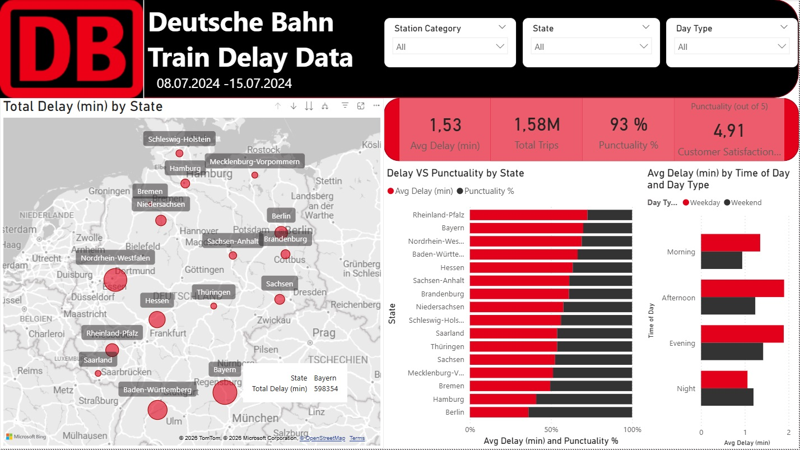
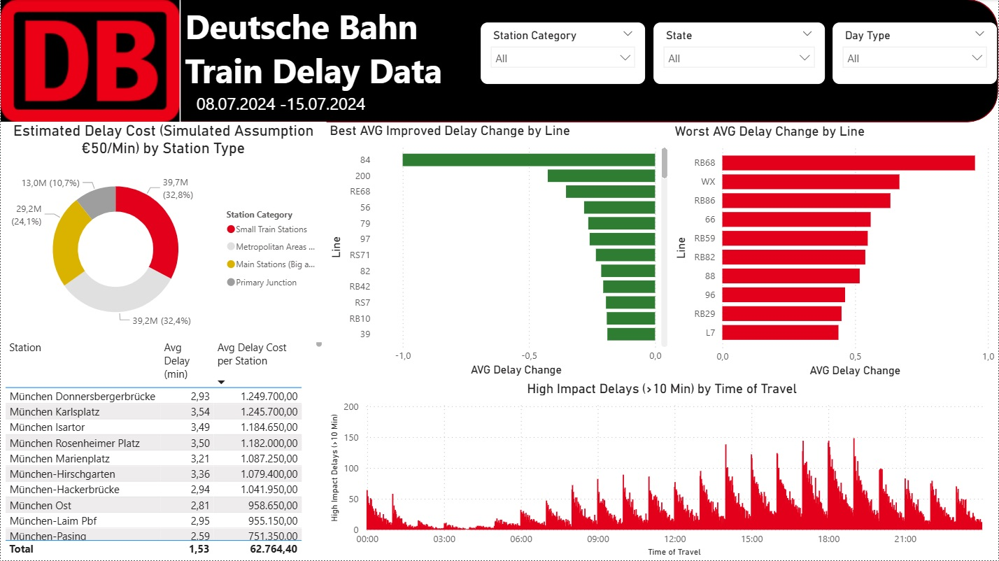

# Deutsche Bahn Train Delay Analysis (Power BI)  
**Rachel Hill-Tsarpelas** | Data Analyst Portfolio Project  

---

## Project Overview

This project analyzes train delay data from Deutsche Bahn for the period **08.07.2024 – 15.07.2024**, based on a dataset of **2,029,894 rows**. The data was sourced from Kaggle and represents train activity across Germany within a one-week timeframe.

The core objective of this analysis was not only to examine delays across regions and time, but to extend the analysis by translating operational delay data into a simulated financial estimate using Power Query and Power BI. By doing so, the project shifts from descriptive analysis toward business-oriented decision support.

---

## Objectives

The analysis focuses on understanding delay patterns across geography, time, and operational structure. This includes evaluating punctuality, identifying high-impact delays, and assessing how delays distribute across stations, train categories, and time periods. A central goal of the project is to estimate the financial implications of delays using a simplified cost model.

---

## Data Preparation

The dataset required extensive preparation before analysis. Column names were cleaned and standardized to ensure consistency within Power BI, moving away from technical naming conventions toward a more readable format.  

Missing values were handled selectively based on their analytical relevance. Records with missing timestamps, particularly in arrival-related fields, were removed when they prevented meaningful delay calculations. Other fields, such as delay causes, were retained despite being largely incomplete (approximately 80% missing), as they may still provide limited contextual value.

Data types were carefully reviewed and corrected, including date, time, and numeric fields. Several conditional columns were created to support later analysis, including Valid Arrivals, Delay Change (min), and binary indicators for Punctuality (Arrival and Departure).

---

## Data Modeling

The dataset was structured into a Star Schema, consisting of one fact table (train delay events) and two dimension tables (Calendar and Location).  

A dedicated calendar table was created using DAX to enable time-based analysis across days of the week and time-of-day segments. During this process, an issue was identified where datetime values were incorrectly used in relationships, requiring adjustments to ensure proper alignment between date and time granularity.

The Location dimension includes geographic attributes such as state, city, and station, as well as derived fields to support mapping within Germany.

---

## Feature Engineering and DAX

A separate measures table was created to organize all DAX calculations. These measures include:

Average Delay (minutes), Average Delay Change, Punctuality (%), Delay Rate (> 6 minutes), High-Impact Delays (>10 minutes), and Total Trips.

In addition, a simulated cost model was implemented, assigning €50 per minute of delay. This enabled the calculation of Average Delay Cost per Station, allowing operational performance to be interpreted in financial terms.

---

## Report Design and Interaction

The report consists of two pages, each designed to present a different analytical perspective.  
Unlike dashboards, these pages are part of a structured Power BI report.

Across both pages, three global filters are applied:
Station Category, State (Bundesland), and Day Type (Weekday vs Weekend).  
These filters allow users to dynamically explore performance differences across regions, station types, and time structures.

---

### Page 1 — Operations Overview

The first page provides a broad operational view of delays across Germany.

**Visuals included:**

- **Map (Bubble Map):** Total delay (minutes) by Bundesland  
- **KPI Cards:** Average Delay, Total Trips, Punctuality, Customer Satisfaction  
- **Stacked Bar Chart:** Delay vs Punctuality by State (ranked from least to most punctual)  
- **Clustered Bar Chart:** Time-of-day analysis (Morning, Afternoon, Evening, Night) split by weekday vs weekend  

This page highlights how delays are distributed geographically and temporally, with a focus on identifying when and where performance deviates.

---

---

### Page 2 — Business Impact Analysis

The second page focuses on translating operational delays into business impact.

**Visuals included:**

- **Donut Chart:** Estimated delay cost by station category  
- **Bar Charts (Horizontal):**  
  - Best average delay improvements by train line (delay recovery)  
  - Worst average delay changes by train line (delay increase)  
- **Column Chart:** High-impact delays (>10 minutes) by hour of day  
- **Table:** Station-level comparison of Average Delay and Average Delay Cost  

This page allows comparison between operational performance and financial impact, highlighting how different station types and train lines contribute to overall cost.

---

---

## Key Insights

The analysis reveals that high-volume regions, such as Munich, generate the largest overall delay impact despite relatively small average delays. In contrast, smaller and mid-sized stations tend to show higher average delays but contribute less to total impact due to lower traffic volume.

Delays are strongly concentrated during peak commuting periods, particularly weekday afternoons and evenings. This indicates that timing plays a significant role in operational strain.

From a financial perspective, the results show that impact is driven more by volume and consistency than by extreme individual delays.

---

## Challenges and Learnings

Working with this dataset highlighted several practical challenges. Missing and inconsistent time data required careful filtering decisions, particularly when delay calculations depended on complete timestamp information.

Geographic mapping also required adjustments, as provided latitude and longitude data did not consistently resolve correctly within Power BI. Time-based analysis introduced additional complexity due to mismatches between date and datetime fields, requiring corrections in the data model.

Additionally, deleting columns to improve report performance introduced issues when further transformation steps were needed. In future workflows, such optimizations would be deferred until the model is finalized.

Finally, the delay cause variable proved largely unusable due to the high percentage of missing values, limiting its contribution to the analysis.

---

## Conclusion

This project demonstrates end-to-end data analysis in Power BI, from data preparation and modeling to business-focused insights.

Although the dataset covers only one week, the use of a DAX-driven calendar enabled analysis across different times of day and weekdays, allowing for meaningful comparisons between regions and major cities.

Rather than focusing solely on average delays, the analysis emphasizes business impact. A simulated cost model (€50 per delay minute) was introduced to highlight how operational performance translates into financial consequences.

The results show a key distinction: while smaller regional stations exhibit higher average delays, their overall financial impact remains limited. In contrast, large metropolitan areas such as Munich generate significantly higher total costs due to high traffic volume.

By extending delay analysis into financial terms, this project demonstrates how operational data can be reframed to better support strategic, data-driven decision-making.
